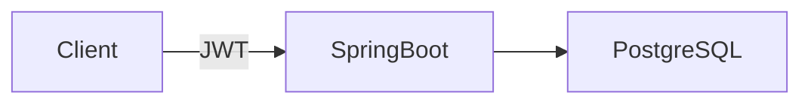

# TaskFlow

JWT認証付きタスク管理API  
(Spring Boot + PostgreSQL + Docker)

---

## ■ 概要

TaskFlowは、ユーザーごとにタスクを管理できるREST APIです。

本プロジェクトは以下を重視して設計しています：

- ステートレスなJWT認証
- ユーザー間のデータ完全分離
- 例外レスポンスのJSON統一
- Dockerによる再現性のある開発環境

---

## ■ 技術スタック

| 分類 | 技術 |
|------|------|
| Backend | Spring Boot 4 |
| Security | Spring Security + JWT |
| ORM | Spring Data JPA |
| Database | PostgreSQL |
| Build Tool | Maven |
| Container | Docker / Docker Compose |

---

## ■ アーキテクチャ

Controller  
→ Service  
→ Repository  
→ Database

認証は `JwtAuthFilter` にて実施しています。

---

## ■ ER図

### User
- id
- username
- password

### Task
- id
- title
- description
- status (TODO / DONE)
- priority (LOW / MEDIUM / HIGH)
- dueDate
- user_id (FK)

---

## ■ API仕様

### 認証

POST /api/auth/register  
POST /api/auth/login

レスポンス例：

```json
{
  "token": "JWT_TOKEN"
}
```

---

### タスクAPI（JWT必須）

GET /api/tasks/{id}  
POST /api/tasks  
PUT /api/tasks/{id}  
DELETE /api/tasks/{id}

Authorizationヘッダー必須：

```
Authorization: Bearer {token}
```

---

## ■ セキュリティ仕様

- JWTによる認証
- 認証失敗 → 401（JSON）
- 権限不足 → 403（JSON）
- 他ユーザーのタスク取得不可（404）

例：

```json
{
  "error": "UNAUTHORIZED",
  "message": "Authentication required",
  "path": "/api/tasks/1"
}
```

---

## ■ システム構成図



---

## ■ 起動方法

```bash
docker compose up --build
```

API  
http://localhost:8081

Swagger  
http://localhost:8081/swagger-ui/index.html

---
---

## ■ 動作確認（Swagger）

Swagger  
http://localhost:8081/swagger-ui/index.html

### 1) ユーザー作成（初回のみ）
`POST /api/auth/register` を実行

例：
```json
{
  "username": "userA",
  "password": "Passw0rd!"
}
```

同様に userB も作成：
```json
{
  "username": "userB",
  "password": "Passw0rd!"
}
```

### 2) ログインしてJWT取得
`POST /api/auth/login` を実行

例：
```json
{
  "username": "userA",
  "password": "Passw0rd!"
}
```

レスポンス例：
```json
{
  "token": "xxxxx.yyyyy.zzzzz"
}
```

### 3) Authorize（🔑）にJWTを設定
Swagger右上の **Authorize（🔑）** を押して、以下を入力：

```
Bearer {token}
```

例：
```
Bearer xxxxx.yyyyy.zzzzz
```

> ※ `Bearer ` を二重に入れないこと（`Bearer Bearer ...` になるとJWTがパースできず401になります）

### 4) タスク作成（userA）
`POST /api/tasks` を実行（JWT必須）

例：
```json
{
  "title": "First task",
  "description": "created by userA",
  "status": "TODO",
  "priority": "MEDIUM",
  "dueDate": "2026-03-01"
}
```

`201 Created` で `id` が返ります。

### 5) タスク取得（userA）
`GET /api/tasks/{id}` を実行  
→ `200 OK`

### 6) userBに切り替えて取得できないことを確認
- `POST /api/auth/login` を userB で実行し token を取得
- Authorize（🔑）に userB の token を設定し直す
- `GET /api/tasks/{id}` を実行

→ **`404 Not Found`**（他ユーザーのデータは取得不可）

### 7) token無しで401（JSON）になることを確認
Authorizeを解除（🔓）して `GET /api/tasks/{id}` を実行  
→ `401 Unauthorized`（JSONレスポンス）

## ■ 今後の拡張予定

- ページング一覧APIの改善
- 検索機能追加
- フロントエンド（Next.js）実装
- AWSデプロイ
- CI/CD導入

---

## ■ 設計思想

- ビジネスロジックはService層に集約
- セキュリティはFilter層で分離
- 例外はGlobalExceptionHandlerで統一管理
- Dockerにより環境差異を排除

---

## ■ 作者

Nozomu Kudo